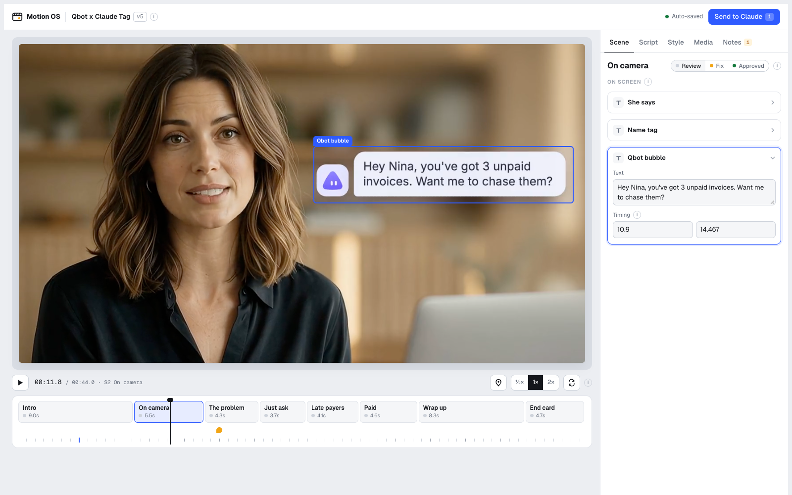

# Motion OS AXI

Motion OS AXI is independently maintained by [Zhiyao](https://github.com/zhiyao). It started from [Motion OS](https://github.com/jasonlee-breadcrumb/motion-os), created by [Jason Lee](https://www.youtube.com/@JasonLeeFinance), and builds on that foundation with the `motion-os-axi` command-line interface and an agent feedback queue for reviewing and updating videos.

The original project's MIT license and Jason Lee's copyright notice are retained in [LICENSE](LICENSE).

**Ask Claude for a motion graphic. Review it scene by scene in a local player. Send your changes back in one prompt.**

<picture>
  <source media="(prefers-color-scheme: dark)" srcset="docs/screenshot-dark.png">
  
</picture>

Motion OS is a [Claude Code](https://claude.com/claude-code) skill plus a small player that runs on your machine. Claude builds the video in code (Remotion recommended), renders it, and opens it in the player. You click anything on screen to change its text or timing, pin notes on the exact moment and spot you want changed, then hit **Send to Claude**. That gives you one prompt with every timestamp and description. Paste it into Claude, and the player reloads with the new version when it's ready.

No account, no upload, no server in the cloud. Everything stays on your computer.

## How it works

1. **You ask:** "Make a 30 second launch video for my budgeting app, using motion-os."
2. **Claude builds it:** writes the motion code, renders `video.mp4`, and describes every scene and element in `reel.json`.
3. **The player opens:** `localhost:4321` shows the video, a scene timeline, and every text, color and asset as an editable field.
4. **You review:** edit copy directly, or press **N** and click the frame to pin a note ("this bubble covers her face").
5. **Send to Claude:** copy the prompt it builds and paste it into Claude. Claude applies it, re-renders, and the player reloads itself.

## Install

You need [Claude Code](https://claude.com/claude-code), [Node.js](https://nodejs.org) 18 or newer, and [ffmpeg](https://ffmpeg.org).

```bash
git clone https://github.com/zhiyao/motion-os-axi ~/.claude/skills/motion-os
```

That's it. Claude Code picks up the skill automatically. To use it in one project only, clone it into that project's `.claude/skills/motion-os` instead.

## Use it

In Claude Code, ask for a video and mention the skill:

```
Use motion-os to make a 30 second launch video for my app Pocket.
Here's the reference I like: https://youtu.be/...
My logo and screenshots are in ./brand
```

Claude asks only for what's missing, builds the video, checks its own render, and opens the player.

### In the player

| To do this | Do this |
|---|---|
| Change a text, color, image or timing | Switch to **Edit** (E), click the element in the frame (or pick it in the Scene tab) and edit its fields |
| Move or resize something | In **Edit**, drag the element to move it, drag a corner to resize. Switch back to **Preview** to play it |
| Get a new video file with your changes | **Export MP4** (live projects only, see below). Saves to `exports/`, never overwrites |
| Fix wording fast | Open the **Script** tab: every word in the video, in order |
| Ask for something a field can't change (motion, pacing, layout) | Press **N**, click the spot in the frame, type the note |
| Mark a scene as done | Set it to **Approved**. Claude leaves approved scenes alone |
| Send your changes | **Send to Claude**, then **Copy prompt**, then paste it into Claude |

Keys: Space play/pause, E toggles Preview/Edit, arrow keys step one frame (Shift for one second), `[` `]` jump between scenes, N toggles note mode. Edits save automatically in your browser.

**Live projects.** When Claude builds in Remotion, it can also ship a small live renderer (`"live"` in reel.json). The player then draws the real video in the page instead of the mp4, so moves and resizes show for real the moment you make them, and **Export MP4** bakes them into a new file without going back to Claude. Text, color and timing edits still go through Send to Claude. Without a live renderer, moves and resizes show as a preview and Claude applies them on the next render.

### What Claude receives

```
Motion OS feedback for "Qbot x Claude Tag" v5
Project: examples/qbot-tag · 1920x1080 · 30 fps · 44.0s

## Edits (apply exactly)
- [00:10.9 · S2 · Qbot bubble] Text (src/v2.tsx:QbotSays): "Hey Nina, you've got 3 unpaid invoices..." -> "Hey Nina, 3 invoices are unpaid..."

## Notes (what I want changed)
1. [00:11.8 · S2 On camera · x 23.9% y 81.8%] Bubble should slide in from the right instead of popping.

## Scenes
S1 Intro (00:00.0-00:09.0): in review
S2 On camera (00:09.0-00:14.5): needs changes
...
```

## Try the example

The repo includes a finished 44 second video (an invoicing app launch, footage generated with Higgsfield) so you can see the player without building anything:

```bash
cd ~/.claude/skills/motion-os
node player/serve.mjs examples/qbot-tag
```

The music was removed from the example because the track is licensed. Voice and sound effects are still there.

## Open any project

```bash
node ~/.claude/skills/motion-os/player/serve.mjs path/to/your-project
```

The folder needs a `reel.json` and the video it points to. Add `--port 5000` to pick a port, or `--no-open` to skip opening the browser.

## reel.json

One file describes the whole video: scenes, elements, copy, timings, brand colors and fonts, assets. Claude writes it, the player reads it. See [`examples/qbot-tag/reel.json`](examples/qbot-tag/reel.json) for a full example and [`SKILL.md`](SKILL.md) for the schema.

## FAQ

**Does anything leave my computer?** No. The player is a single HTML file served on `localhost`. Nothing is uploaded until you paste the prompt into Claude yourself.

**Where are my edits saved?** In your browser, per project. When the next version loads, edits you already sent are cleared and anything you hadn't sent is kept.

**Do I have to use Remotion?** No. Any tool that renders a video file works, as long as Claude writes the `reel.json`. Remotion works best because the copy can live in `reel.json` directly. Note that Remotion is free for individuals and companies of 3 or fewer people; bigger teams need a [company license](https://www.remotion.dev/license).

**Windows?** The player works anywhere Node runs. If the browser doesn't open on its own, open the URL it prints.

## Files

```
SKILL.md              instructions Claude follows
player/index.html     the player (one file, no build step)
player/serve.mjs      tiny local server, no dependencies
examples/qbot-tag/    example project: reel.json, video.mp4, assets/
docs/                 screenshots
```

Maintained by [Zhiyao](https://github.com/zhiyao). Based on [Motion OS](https://github.com/jasonlee-breadcrumb/motion-os) by [Jason Lee](https://www.youtube.com/@JasonLeeFinance). MIT license.
